 
 

> [!WARNING]  
> [`Wallop`](https://github.com/gongahkia/wallop)'s Vercel deployment is inactive as of 21 February 2025.
  
> [!IMPORTANT]  
> Please read through [this disclaimer](#disclaimer) before using [Wallop](https://github.com/gongahkia/wallop).

# `Wallop` 🥊

Tinder for recreational fighters.

## Rationale

Sick of polite smalltalk and gentle interactions? 

Presenting `Wallop`, the web app that cuts right to the chase. 
  
We match fighters who want to throw hands without the bullshit. Calling all martial artists, amateur boxers, keyboard warriors or weekend tweakers - this is your time to shine.

`Wallop` features

* ✅ No-nonsense user verification
* 🥋 Skill-level matching that doesn't lie
* 🛡️ Real safety protocols
* 📍 Public meetup spots for group accountability
* 🤝 Comprehensive consent mechanisms

What are you waiting for? [Get started](#usage) with `Wallop` today!

## Usage

Build [`Wallop`](https://github.com/gongahkia/wallop) locally by following these instructions [here](./src/README.md).

## Architecture

### Overview

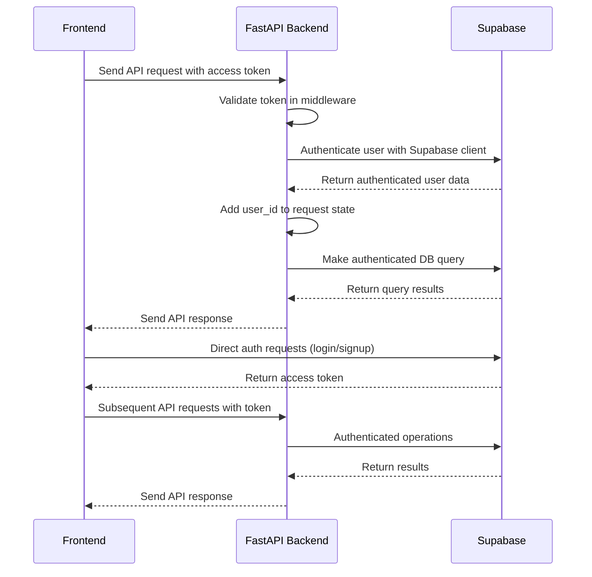

### DB

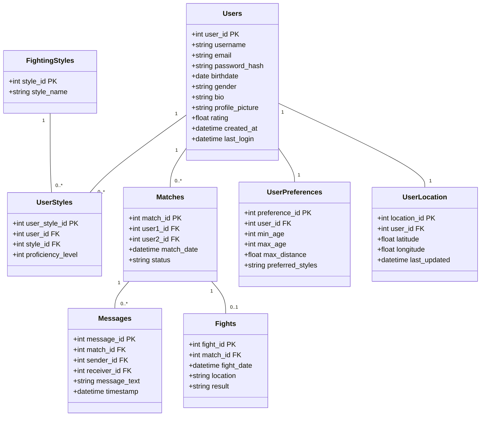

## Screenshot

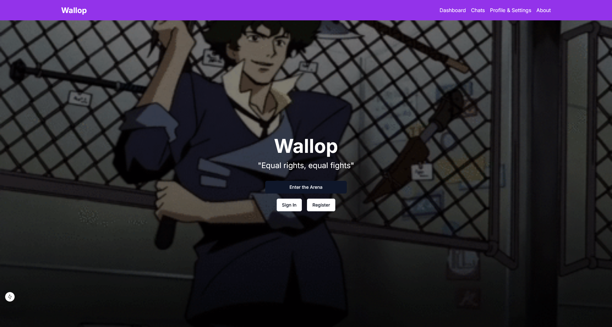
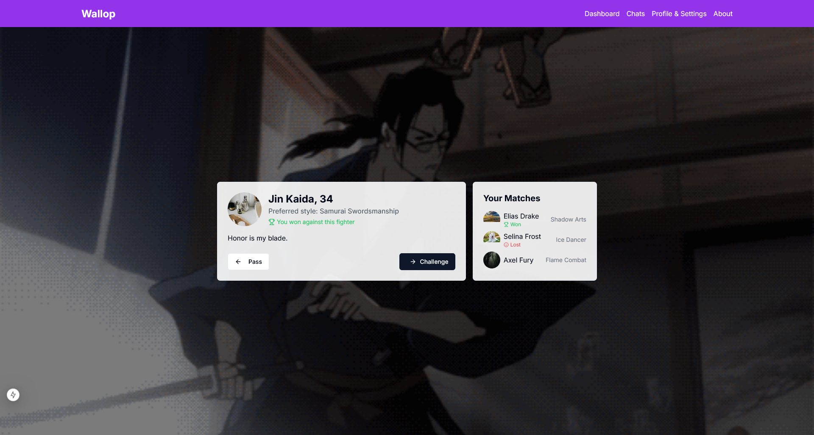
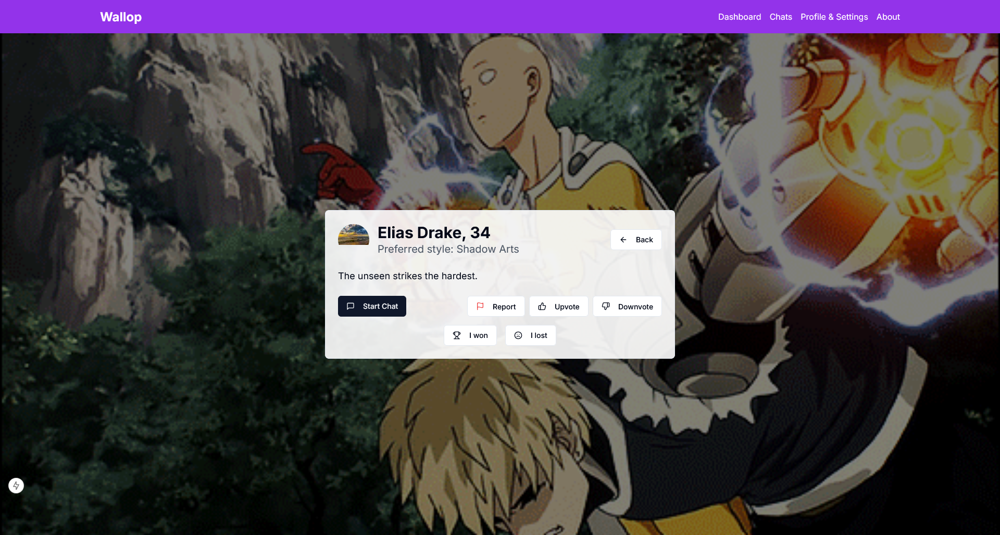
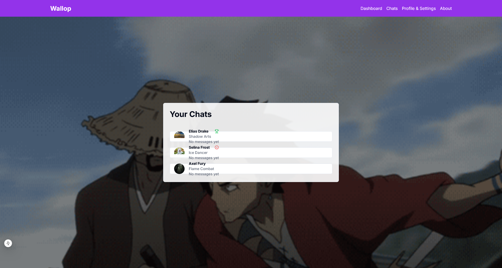
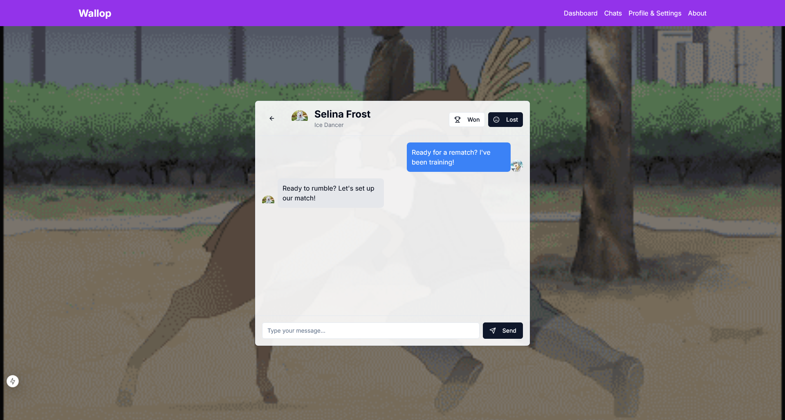
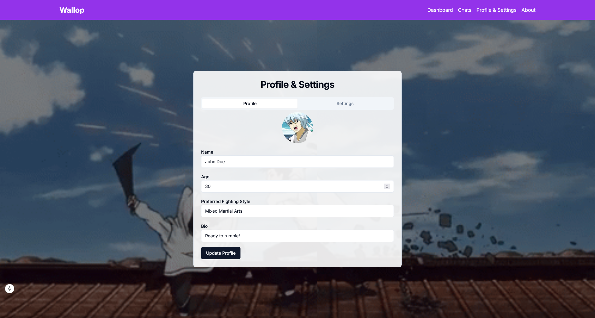
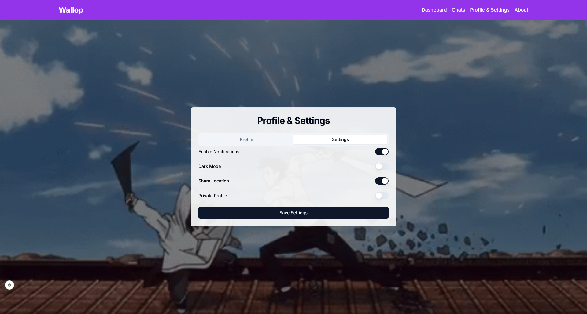
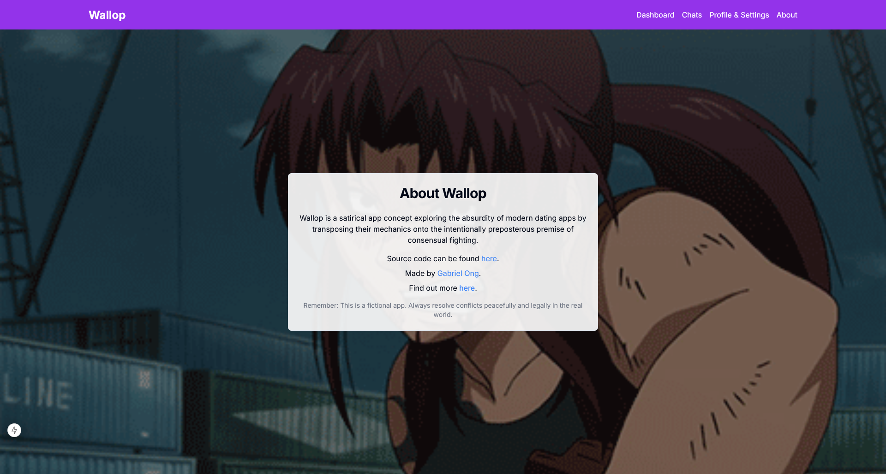
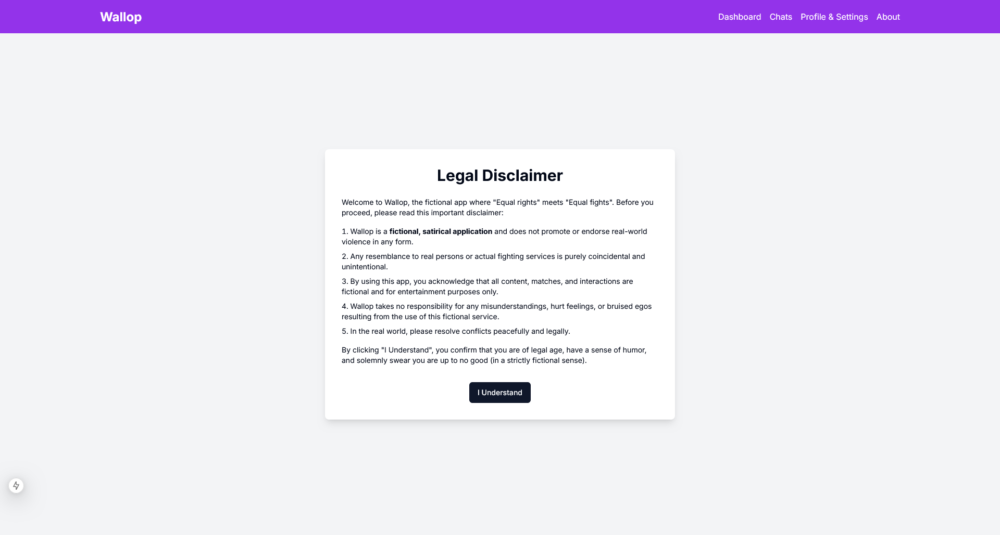
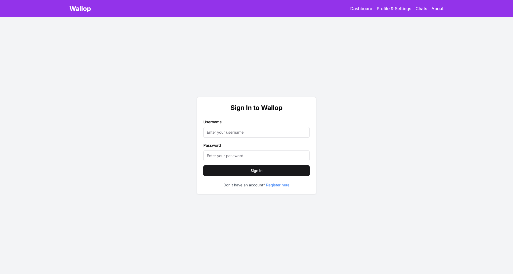

## Disclaimer

### 1. Purpose of the Application

If it was not immediately apparent, this application is an act of [satirical](https://dictionary.cambridge.org/dictionary/english/satirical) [social commentary](https://dictionary.cambridge.org/dictionary/english/social-commentary), meant to expose the absurdity of modern dating apps by transposing their mechanics onto the intentionally preposterous premise of consensual fighting.  
  
Please be aware that while [`Wallop`](https://github.com/gongahkia/wallop) is a functional web application, it is **not** intended for any actual use, **nor** does it endorse or facilitate any actual fighting. [`Wallop`](https://github.com/gongahkia/wallop) is meant as a purely theoretical platform and all content in this README.md and any source code is protected under artistic speech.

### 2. Resemblance

Any substantive similarity or resemblance to existing digital services, social platforms, human behavioral patterns or actual persons is purely coincidental and constitutes part of [`Wallop`](https://github.com/gongahkia/wallop)'s satirical methodology. [`Wallop`](https://github.com/gongahkia/wallop) therefore expressly disclaims any intentional reference to or imitation of any existing digital services, social platforms, human behavioral patterns or persons. 

### 3. User Acknowledgement

By engaging with [`Wallop`](https://github.com/gongahkia/wallop), users acknowledge they are participating in a meta-commentary on social technology, digital interaction, and human connection and also understand its purely theoretical nature.

## Credit

Concept-wise, `Wallop` takes much inspiration from [Rumblr](https://rumblr.webflow.io/). However, the idea for a *'tinder but for fighting'* app only really came to my attention after a conversation with [Jace Bong](https://www.linkedin.com/in/jace-bong-%F0%9F%91%BE-42b3841b1/?originalSubdomain=sg) in [IS111](https://www.reddit.com/r/SMU_Singapore/comments/14bouko/smu_is_tough_modules_and_is111/?rdt=39799) in my first semester of [university](https://www.smu.edu.sg/).

I've slept on the idea until now, but hopefully I have done it justice.
